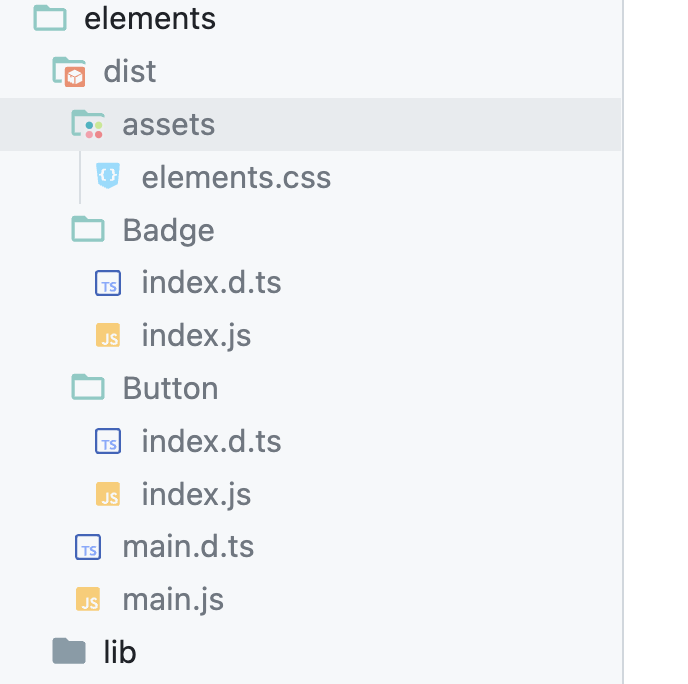

import CodeBlock from "@theme/CodeBlock";
import Tabs from '@theme/Tabs';
import TabItem from '@theme/TabItem';

# Introduction

In this post, I will walk you through how to build a component library for React using Vite and Tailwind. We will also see how to publish it to npm and use it in a React application. We will also integrate auto for versioning and release notes. 

{/* truncate */}

import SeriesHeader from './_sample.mdx';

<SeriesHeader part="part 1" />

## Requirements

- We will create a react component library using Vite and Tailwind
- We will publish the component library to npm
- We will publish documentation to GitHub pages using Docusaurus
- Make all this setup in a monorepo built with Lerna
- Automate Release Versioning & Release Notes using auto

## Setup

### Initialize Codebase

We will use lerna to setup our codebase and add docusaurus for documentation.

```bash
npx lerna init --packages="packages/*" --packages="apps/*"
```

### Create Docusaurus App

```bash
npx create-docusaurus@latest apps/docs classic --typescript
```

### Create Vite React App

**Run following command**

```bash
npm create vite@latest packages/elements -- --template react-ts
```

**Change package name**

Change name in package.json to `@rcls/elements` (actually to something you like)


### Setup scripts

*Add following scripts to root package.json*

```json reference title="package.json" customStyling="true"
https://github.com/rjvim/react-component-library-starter/blob/main/package.json#L8-L16
```

### Test Setup

- Build docs: `npm run docs:build`
- Build package: `npm run package:build`
- Build everything: `npm run build`

If both of these work, then setup is complete. If anything seems to fail, you can clean the repo and build again using `npx lerna clean -y && npm install`

### Push to Github

Create a github public repo on Github and push codebase to it, as in next steps we would be using github actions.

## Setup Component Library

### Install Tailwind 3

Note that we are installing Tailwind 3 here, we will have alternate section to do the same with tailwind v4

Go to package directory `cd packages/elements`

```bash
npm install -D tailwindcss postcss autoprefixer tailwindcss-scoped-preflight
npx tailwindcss init -p --ts
```

Update tailwind config to:

```ts reference title="packages/elements/tailwind.config.ts" customStyling="true"
https://github.com/rjvim/react-component-library-starter/blob/main/packages/elements/tailwind.config.ts
```

Let's note few things which we have done here:

- We added prefix
- We scope preflight

We did both of these things so that our component styles won't override styles of the app where we install our component package.

`twp` is the scoping class which will force tailwind preflight classes to be valid only when there is `class="twp"` on an element or the parent wrapper.

### Add index.css

- Delete default `src/index.css`
- Add index.css file at `packages/elements/index.css` with following contents

```css title="packages/elements/index.css"  
@tailwind base;
@tailwind components;
@tailwind utilities;
```

### Test Tailwind

Replace App.jsx default content with following:

```tsx title="packages/elements/src/App.tsx"
import "../index.css";

export default function App() {
  return <h1 className="twp el-text-3xl el-font-bold el-bg-red-400 el-underline">Hello world!</h1>;
}
```

## Implement Components

In this section we will implement couple of components and couple of components. To demonstrate build which can be tree shaked, I have added two components

Run `npm run package:dev` and you should see Hello World in red background! This is a temporary change to test if tailwind is working fine before we move on to library changes.

<Tabs>
<TabItem value="Button" label="Button">
```js reference title="packages/elements/lib/Button/index.tsx"
https://github.com/rjvim/react-component-library-starter/blob/main/packages/elements/lib/Button/index.tsx
```
</TabItem>
<TabItem value="Badge" label="Badge">
```js reference title="packages/elements/lib/Badge/index.tsx"
https://github.com/rjvim/react-component-library-starter/blob/main/packages/elements/lib/Badge/index.tsx
```
</TabItem>
<TabItem value="main" label="main">
```js reference title="packages/elements/lib/main.ts"
https://github.com/rjvim/react-component-library-starter/blob/main/packages/elements/lib/main.ts
```
</TabItem>
</Tabs>

## Configure Vite for Library

### Prepare Vite

**Install dependencies**

Run the following command inside your package folder, not root folder

```bash
npm i -D vite-plugin-dts react react-dom
```

Next we configure vite so that we can leverage it's lib mode and build our package

<Tabs>
  <TabItem value="package.json" label="package.json" default>
  ```json reference title="packages/elements/package.json"
  https://github.com/rjvim/react-component-library-starter/blob/main/packages/elements/package.json#L1-L43
  ```
  </TabItem>
  <TabItem value="tsconfig.lib.json" label="tsconfig.lib.json" default>
  ```json reference title="packages/elements/tsconfig.lib.json"
  https://github.com/rjvim/react-component-library-starter/blob/main/packages/elements/tsconfig.lib.json
  ```
  </TabItem>
  <TabItem value="vite.config.ts" label="vite.config.ts">
  ```js reference title="packages/elements/vite.config.ts"
  https://github.com/rjvim/react-component-library-starter/blob/main/packages/elements/vite.config.ts
  ```
  </TabItem>
  <TabItem value="vite-env.d.ts" label="vite-env.d.ts">
  ```js reference title="packages/elements/lib/vite-env.d.ts"
  https://github.com/rjvim/react-component-library-starter/blob/main/packages/elements/lib/vite-env.d.ts
  ```
  </TabItem>
</Tabs>

Let's understand what we are doing above:

- We allowed public access so that we can push to npm 
- In package.json we are configure what would be exported, and also marking react as peerDependency so that it won't get installed when someone installs our package
- We are also exporting our .css file, make sure the name of the file matches with what's generated in your repo. The file name would be package name.
- We are configuring lib mode in vite file to generate build files, exclude few packages, and prepare types

### Run Dev

**Add App.tsx**

```tsx reference title="packages/elements/src/App.tsx" customStyling="true"
https://github.com/rjvim/react-component-library-starter/blob/main/packages/elements/src/App.tsx
```

From the root folder run `npm run package:dev` and you should see your button and label component with proper styling. If not, stop here and debug it further.

### Run Build

If dev is working fine, we will now just run `npm run package:build` - This should go all smooth.



It has been long journey till here, pat your back. We have much more to do. Next we will publish this package to npm.