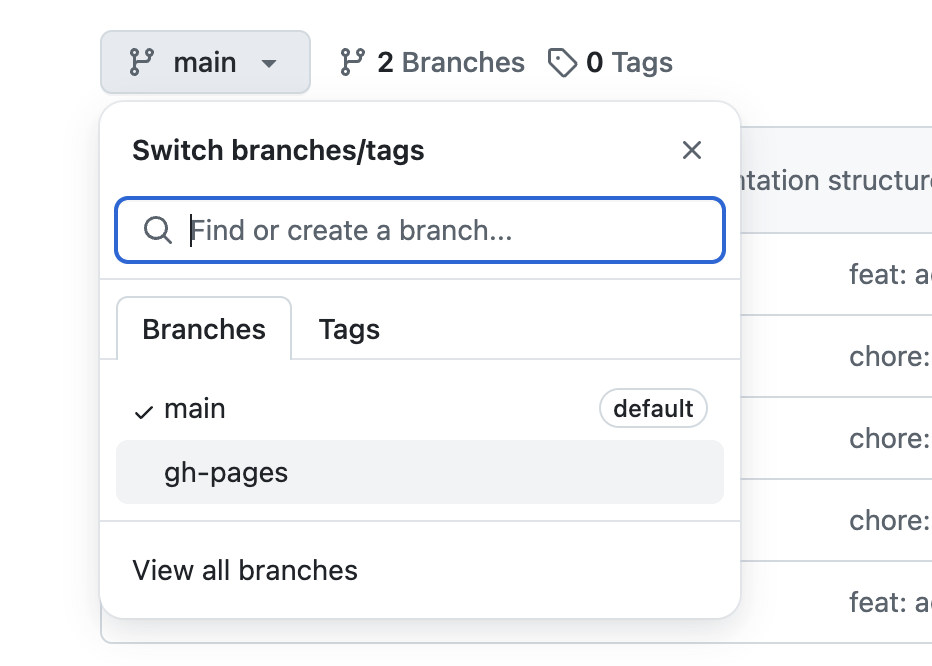
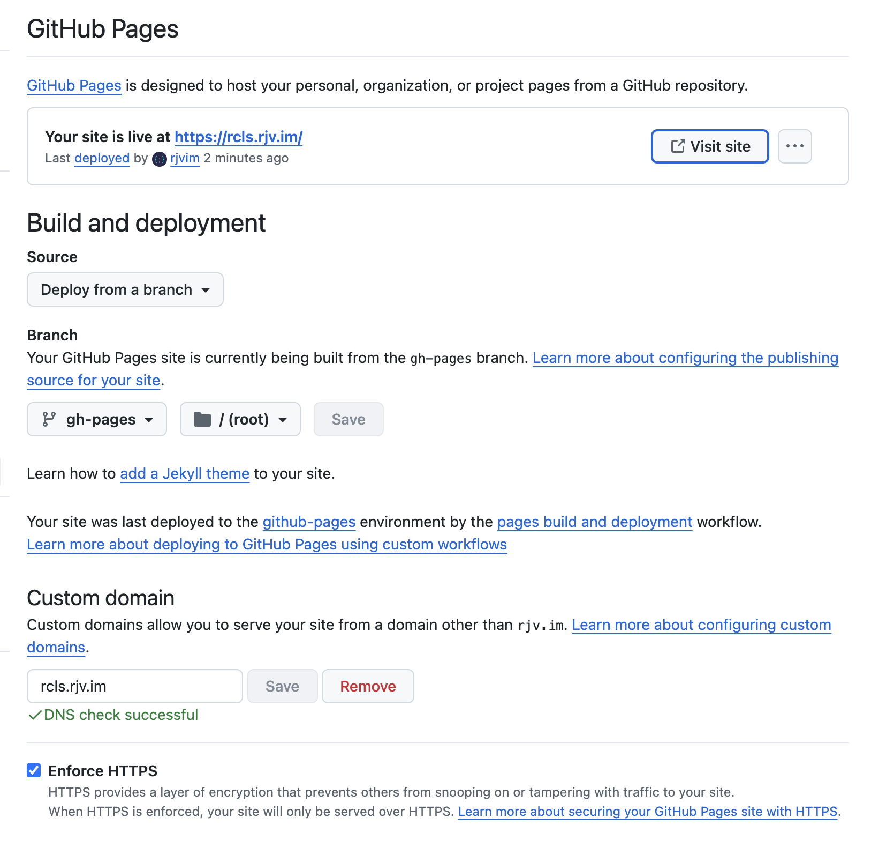

import CodeBlock from "@theme/CodeBlock";

# Introduction

In this post, I will walk you through how to build a component library for React using Vite and Tailwind. We will also see how to publish it to npm and use it in a React application.

{/* truncate */}

## Requirements

- We will create a component library using Vite and Tailwind
- We will publish the component library to npm
- We will publish documentation to GitHub pages using Docusaurus
- Make all this setup on a monorepo
- Automate Release Versioning & Release Notes using auto

# Setup

## Initialize Codebase

We will use lerna to setup our codebase and add docusaurus for documentation.

```bash
npx lerna init --packages="packages/*" --packages="apps/*"
```

## Install Docusaurus

*Create docusaurus app*

```bash
npx create-docusaurus@latest apps/docs classic --typescript
```

*Add docusaurus scripts to root package.json*

```json title="package.json"
"scripts": {
    "docs:start": "lerna run start --scope apps-docs",
    "docs:build": "lerna run build --scope apps-docs",
    "docs:serve": "lerna run serve --scope apps-docs",
    "docs:deploy": "lerna run deploy --scope apps-docs"
}
```

**Test docs build**

Run `npm run docs:build` and test if build is successful, ideally it should just work. 

**Push to Github**

Create a git repo on Github and push codebase to it, as next step is we would be deploying to Github pages.

**Configure docusaurus file**

```typescript title="docusaurus.config.ts"
{
  organizationName: 'orgName-or-Username', // Put your GitHub org/user name.
  projectName: 'projectName', // Put your repo name.
}
```

**Deploy to Github Pages**

The first deployment to Github pages is manual, but we will automate it in the next steps.

```bash
npm run docs:deploy
```

//TODO: put image of gh-pages



**Configure Domain**

Depending on which endpoint you want to deploy you have to configure baseUrl accordingly and do some DNS mapping on your domain. If you are going to use `*.github.io` you won't have to configure DNS. But you would need to configure `baseUrl` accordingly.


```typescript title="docusaurus.config.ts"
{
  baseUrl: "???"
}
```

Once you configure, things would start looking like following:

> Here I have configured at `rcls.rjv.im`, so I had to do DNS mapping.



## Install Vite

Now to the meat of the problem, we will install Vite and Tailwind in our component library. Just being by running following:

```bash
npm create vite@latest packages/elements -- --template react-ts
```

Change package.json name to `@rcls/elements` (actually to something you like)

**Add scripts to package.json**

```json title="package.json"
"scripts": {
  ...
  "package:build": "lerna run build --scope @rcls/elements",
  "package:dev": "lerna run dev --scope @rcls/elements"
}
```

**Build**

Try to check if build is working fine by running `npm run package:build`, and if it fails (like can't find some packages), just run `npm install` in the root directory and run build command again.

### Install Tailwind 3

Note that we are installing Tailwind 3 here, we will have alternate section to check same on with tailwind v4

Go to package directory `cd packages/elements`

```bash
npm install -D tailwindcss postcss autoprefixer
npx tailwindcss init -p --ts
```

Update tailwind config to:

import { defineConfig } from 'vite';
import react from '@vitejs/plugin-react';
import path from 'path';

export default defineConfig({
  plugins: [react()],
  resolve: {
    alias: {
      '@': path.resolve(__dirname, './src'),
    },
  },
  css: {
    preprocessorOptions: {
      scss: {
        additionalData: `@import "@/styles/variables.scss";`,
      },
    },
  },
});

```ts title="packages/elements/tailwind.config.ts"
  content: [
    "./index.html",
    "./src/**/*.{js,ts,jsx,tsx}",
    "./lib/**/*.{js,ts,jsx,tsx}",
  ],
```

Important: Delete src/index.css and it's usage in main.tsx

Add index.css file

```css title="packages/elements/index.css"  
@tailwind base;
@tailwind components;
@tailwind utilities;
```

Replace App.jsx default content

```tsx title="packages/elements/src/App.tsx"
import "../index.css";

export default function App() {
  return <h1 className="text-3xl font-bold bg-red-400 underline">Hello world!</h1>;
}
```

Run `npm run package:dev` and check if it's working fine. You should see Hello World in red background! This is a temporary change to test if tailwind is working fine before we move on to library changes.


import Tabs from '@theme/Tabs';
import TabItem from '@theme/TabItem';

<Tabs>
  <TabItem value="apple" label="Apple" default>
  ```json reference title="packages/elements/tsconfig.lib.json"
  https://github.com/rjvim/react-component-library-starter/blob/main/packages/elements/tsconfig.lib.json
  ```
  </TabItem>
  <TabItem value="vite.config.ts" label="vite.config.ts">
  ```js reference title="packages/elements/vite.config.ts"
  https://github.com/rjvim/react-component-library-starter/blob/main/packages/elements/vite.config.ts
  ```
  </TabItem>
  <TabItem value="vite-env.d.ts" label="vite-env.d.ts">
  ```js reference title="packages/elements/lib/vite-env.d.ts"
  https://github.com/rjvim/react-component-library-starter/blob/main/packages/elements/lib/vite-env.d.ts
  ```
  </TabItem>
  <TabItem value="Button" label="Button">
  ```js reference title="packages/elements/lib/Button/index.tsx"
  https://github.com/rjvim/react-component-library-starter/blob/main/packages/elements/lib/Button/index.tsx
  ```
  </TabItem>
  <TabItem value="Badge" label="Badge">
  ```js reference title="packages/elements/lib/Badge/index.tsx"
  https://github.com/rjvim/react-component-library-starter/blob/main/packages/elements/lib/Badge/index.tsx
  ```
  </TabItem>
  <TabItem value="main" label="main">
  ```js reference title="packages/elements/lib/main.ts"
  https://github.com/rjvim/react-component-library-starter/blob/main/packages/elements/lib/main.ts
  ```
  </TabItem>
  <TabItem value="App.tsx" label="App.tsx">
  ```ts reference
  https://github.com/rjvim/react-component-library-starter/blob/main/packages/elements/src/App.tsx
  ```
  </TabItem>
</Tabs>

Run `npm run package:build`

### Configure package.json

```json title="packages/elements/package.json"
{
  "publishConfig": {
    "access": "public"
  },
  "version": "0.0.0",
  "type": "module",
  "exports": {
    ".": {
      "types": "./dist/lib/main.d.ts",
      "default": "./dist/main.js"
    },
    "./styles.css": {
      "require": "./dist/styles.css",
      "default": "./dist/styles.css"
    }
  },
  "files": [
    "dist"
  ],
  "sideEffects": [
    "**/*.css"
  ],
  "peerDependencies": {
    "@types/react": "*",
    "@types/react-dom": "*",
    "react": "^16.8 || ^17.0 || ^18.0 || ^19.0 || ^19.0.0-rc",
    "react-dom": "^16.8 || ^17.0 || ^18.0 || ^19.0 || ^19.0.0-rc"
  },
  "peerDependenciesMeta": {
    "@types/react": {
      "optional": true
    },
    "@types/react-dom": {
      "optional": true
    }
  },
}
```

#### Build

```bash
npm i -D vite-plugin-dts react react-dom
```

The build should be successful at this point, if not. Go to root directory and run `npx lerna clean -y && npm install && npm run package:build`


### Publish to npm

```bash
npm install -D auto @auto-it/all-contributors @auto-it/conventional-commits @auto-it/npm @auto-it/omit-commits @auto-it/omit-release-notes @auto-it/released
```

Add .autorc file

Add .env file (NPM Token and Github Token)

Checkout into a branch and run `npx auto canary --force`

Let's add github workflows for releasing

Make a branch, raise a PR with "release" label, and merge it. You should see a new release on Github.

Check the release notes: https://github.com/rjvim/react-component-library-starter/releases/tag/v0.1.0

### Write docs

@import "@rcls/elements/rcls-elements.css";

npm install -D @rcls/elements (in site, specific version)

Add docs-deploy workflow and push

Check

### Configure Github Actions

Workflow permissions
